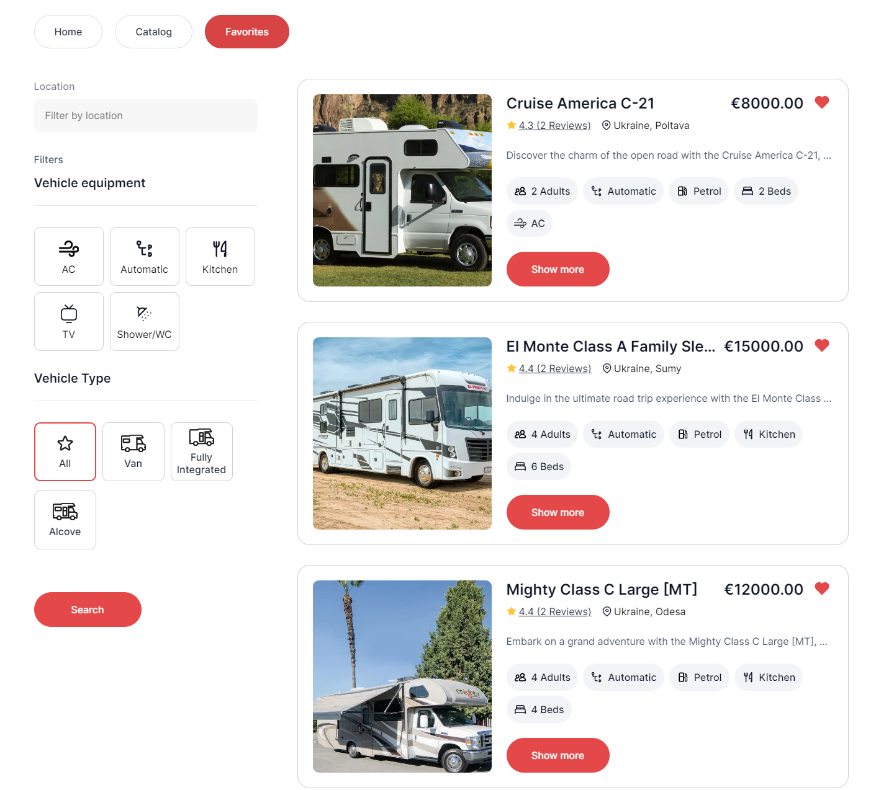

# Ukrainian Camper Rental Application

This project is a web application developed for a company providing camper rental services in Ukraine. The application consists of three main pages:

1. **Home Page**: Provides a general overview of the services offered by the company. The styling and design are implemented according to the preferences.

2. **Catalog Page**: Displays a catalog of campers with various configurations that users can filter by location, equipment, and type.

3. **Favorites Page**: Shows advertisements added by the user to their favorites list.

## Technical Specifications

### Frontend

- Developed using React.js with React Router for navigation.
- State management is handled using Redux.
- Axios library is used for making HTTP requests.
- The UI is styled according to the provided designs, ensuring responsiveness and semantic markup.

### Backend

- A custom backend is created using the UI service provided by [MockAPI](https://mockapi.io/).
- The `adverts` resource is utilized to manage advertisements.
- Each advertisement object includes details about the camper, such as location, equipment, type, and pricing.

### Features

- **Advertisement Card**: Implemented according to the provided layout, with functionalities like adding to favorites, loading more advertisements, and showing detailed information in a modal.
- **Favorites**: Users can add advertisements to their favorites list, and the state is maintained even after page refresh.
- **Modal Window**: Displays detailed information about the camper, including its features, reviews, and a booking form.
- **Form Validation**: Implemented validation for the booking form fields (name, email, booking date).
- **Routing**: Utilized React Router for handling different routes such as home, catalog, and favorites. Invalid routes redirect to the home page.
- **Search and Filters**: Added functionality to search for campers by location and filter by equipment and type.

## Additional Task

- **Deployment**: The project is deployed on Netlify [https://ukrainian-camperrent.netlify.app/](https://ukrainian-camperrent.netlify.app/).

### More photos of the project

